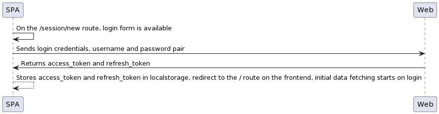
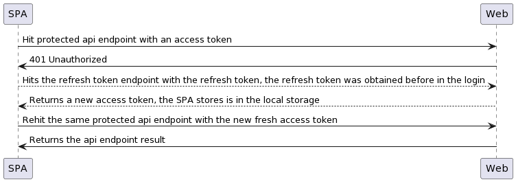
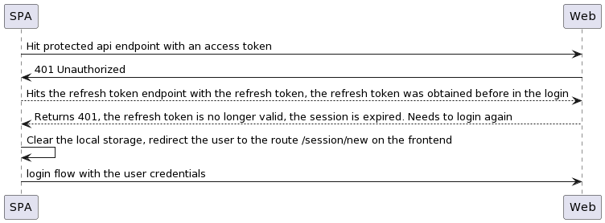

# Trento Single Page Application

The trento single page application, leverages the JWT authentication mechanism of `trento` API, using the refresh token flow when the `access_token` expires.

## Login Diagram

## Refresh Token Success Diagram

## Refresh Token Failure Diagram

All the login/logout procedures are handled by the `SPA` using route guards and authentication providers hooked into the network calls.

