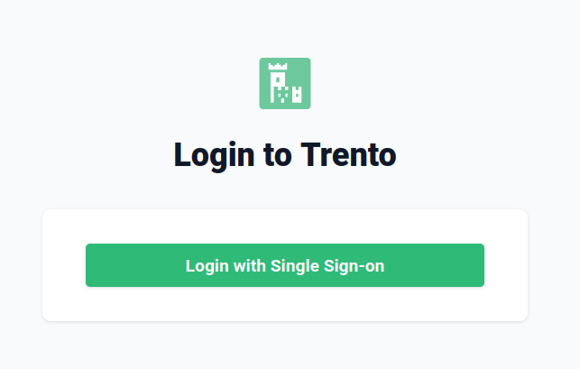
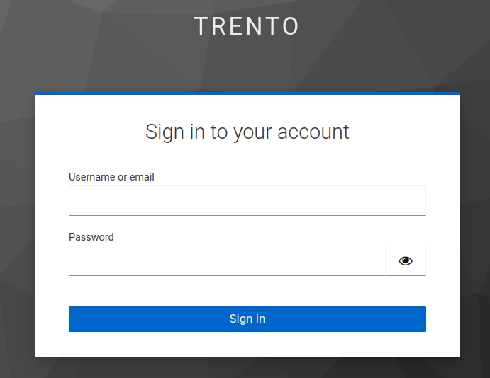

# OpenID Connect

The OpenID Connect (OIDC) feature allows third-party applications to verify the identity of the end-user and to obtain basic user profile information. Instead of managing usernames and passwords directly **trento-web console will rely on an identity provider (IDP) to authenticate users**.

## Enabling OIDC

The OIDC feature is **disabled by default**.

Provide the following environment variable to enable OIDC feature when starting Trento.

```
ENABLE_OIDC=true
OIDC_CLIENT_ID=<<OIDC_CLIENT_ID>>
OIDC_CLIENT_SECRET=<<OIDC_CLIENT_SECRET>>
OIDC_BASE_URL=<<OIDC_BASE_URL>>
OIDC_CALLBACK_URL=<<OIDC_CALLBACK_URL>>
```

## Enabling OIDC in Development

Enable OpenID Connect (OIDC) in the development environment using Docker and [Keycloak](https://github.com/keycloak/keycloak) as a simulated Identity Provider (IDP).

### Enable OIDC in dev environment by editing `config/dev.exs`

Before:

```
config :trento, :oidc,
  enabled: false,
  callback_url: "http://localhost:4000/auth/oidc_callback"
```

After:

```
config :trento, :oidc,
  enabled: true,
  callback_url: "http://localhost:4000/auth/oidc_callback"
```

### Starting the Keycloak Identity Provider

We use a custom Docker profile to start Keycloak as the Identity Provider (IDP) for local development.

Start the Docker containers with the `IDP` profile:

```
docker-compose --profile idp up
```

### Starting Trento Web console

```
iex -S mix phx.server
```

### Access the Trento Web or Keycloak

Access the Trento Web by navigating to http://localhost:4000 in the web browser.
Access the Keycloak server by navigating to http://localhost:8081 in the web browser.

### Login into Trento web console by using Single Sign-on with Keycloak

1. Navigate to the Trento web interface.

2. Click on `Login with Single Sign-on`:



You will be redirected to the Keycloak login page:


### Login as Trento user through keycloak IDP

The default Trento login credentials are:

Username:

```
trentoidp
```

Password:

```
password
```

After successfully entering user login data, the user is redirected to Trento web console.

### Logging into the Keycloak Admin Console

Username:

```
keycloak
```

Password:

```
admin
```

### Assigning Admin Rights to the Trento User

Grant admin rights to the `trentoidp` user, update the `config/dev.exs` file as follows , then restart the application

```
config :trento,
  admin_user: "trentoidp"

config :trento, :oidc,
  enabled: true,
  callback_url: "http://localhost:4000/auth/oidc_callback"
```
